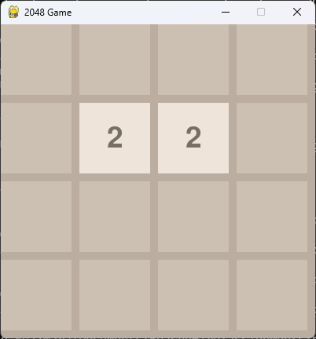
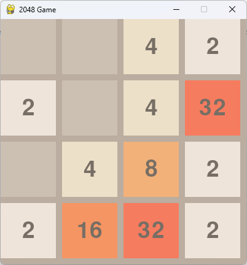
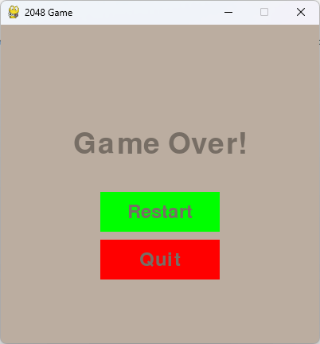

# 2048 Game

This is a Python implementation of the popular 2048 game using Pygame. The game features a 4x4 grid where players combine tiles to reach the 2048 tile and win the game.

## Features

- 4x4 grid gameplay
- Random new tile generation after each move
- Win condition when a 2048 tile is created
- Game over condition when no more moves are possible
- Restart and quit options after winning or losing

## Screenshots
  
  


## Requirements

- Python 3.x
- Pygame

## Controls
- W: Move tiles up
- A: Move tiles left
- S: Move tiles down
- D: Move tiles right

## Installation

1. **Clone the repository**:
   ```bash
   git clone https://github.com/yourusername/2048project.git
   cd 2048project
2. **Install dependencies**:
   ```bash
   pip install -r requirements.txt
3. **Run the Game**:
   ```bash
   python main.py
